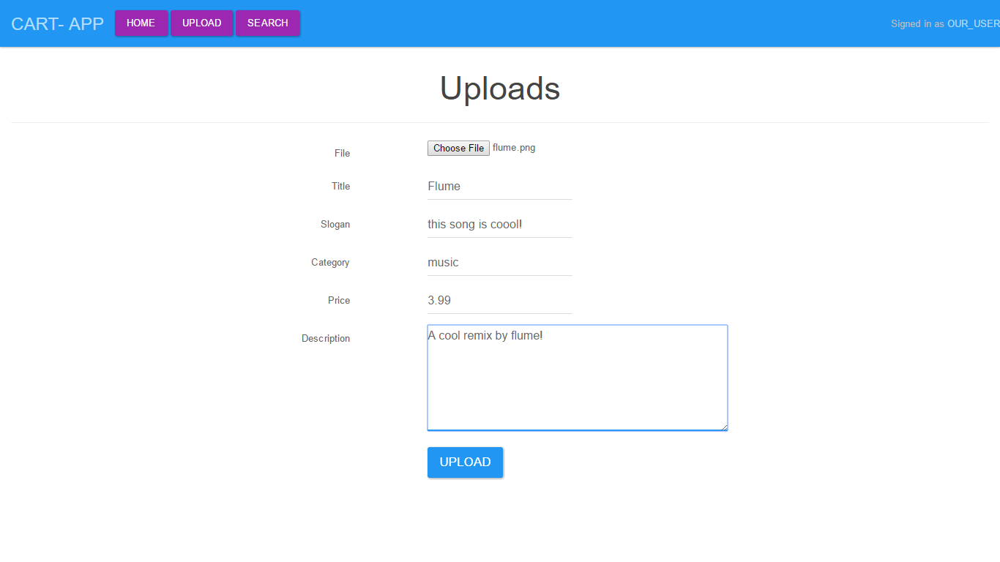
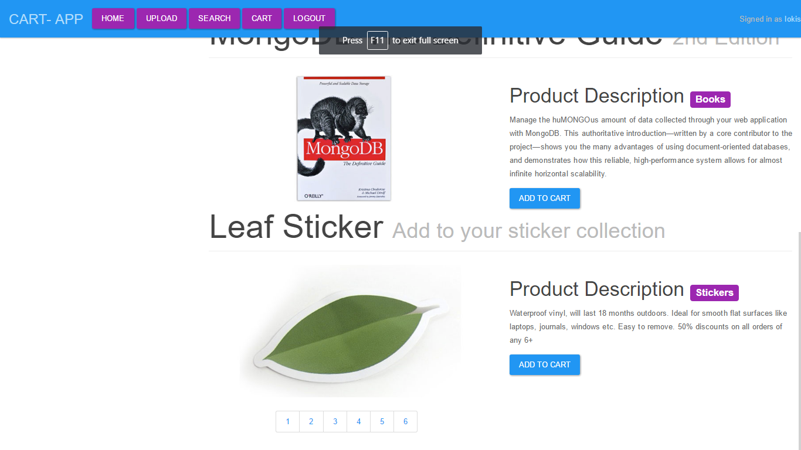

# Ecommerce-lite
A minimal E-commerce application with Pagination,Accounts,Search,Upload items written in PHP , My sql 

# To run locally
> - Change DB details in **config/dbinit.php** to point to your own db instance ex **$host,$username,$password,$dbname**
> - Import **lokiscart.sql** into your db (it will create a table **items** with some data)
> - Now start your local server ex [Wampserver or Xampp] 

# Project Samples
 

